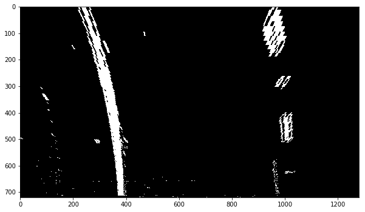
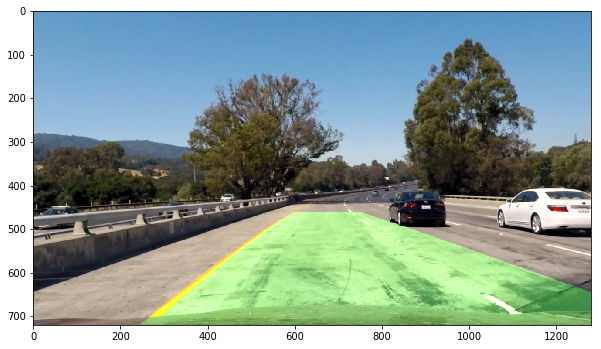
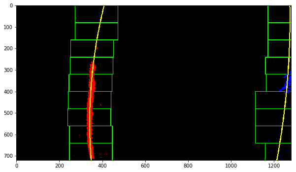

# Advanced Lane Finding Project

The goal of this project is to write a software pipeline to identify the lane boundaries in a video from a front-facing camera on a car. In order to achieve this goal, the following steps are performed:

* Compute the camera calibration matrix and distortion coefficients given a set of chessboard images.
* Apply a distortion correction to raw images.
* Use color transforms, gradients, etc., to create a thresholded binary image.
* Apply a perspective transform to rectify binary image ("birds-eye view").
* Detect lane pixels and fit to find the lane boundary.
* Determine the curvature of the lane and vehicle position with respect to center.
* Warp the detected lane boundaries back onto the original image.
* Output visual display of the lane boundaries and numerical estimation of lane curvature and vehicle position.

The following sections consider these steps individually and describe how each point in the implementation is addressed.

The python code is located in the IPython notebook `AdvancedLaneLines.ipynb`. The function executing all the steps of the pipeline is `pipeline(image)`.

### Camera Calibration

The code for this step is contained in the code cells belonging to section "Compute the camera calibration matrix and distortion coefficients given a set of chessboard images" of the IPython notebook located in `AdvancedLaneLines.ipynb`).  

I start by preparing "object points", which will be the (x, y, z) coordinates of the chessboard corners in the world. Here I am assuming the chessboard is fixed on the (x, y) plane at z=0, such that the object points are the same for each calibration image.  Thus, `objp` is just a replicated array of coordinates, and `objpoints` will be appended with a copy of it every time I successfully detect all chessboard corners in a test image.  `imgpoints` will be appended with the (x, y) pixel position of each of the corners in the image plane with each successful chessboard detection.  

I then used the output `objpoints` and `imgpoints` to compute the camera calibration and distortion coefficients using the `cv2.calibrateCamera()` function.  I applied this distortion correction to the test image `camera_cal/calibration1.jpg` using the `cv2.undistort()` function and obtained this result:


### Pipeline (single images)

The pipeline starts receiving an image (e.g. `test_images/test2.jpg` having a yellow left lane line and a white right lane line):


#### Distortion Correction

Then the input image is distortion corrected by applying the `cv2.undistort()` function to the distorted input `image` and the calibration `calibration_data['cameraMatrix']` and distortion coefficients `calibration_data['distCoeffs']` (which were obtained from the `cv2.calibrateCamera()` function as described in the section "Camera Calibration"):

```python
def undistort(image, calibration_data):
    return cv2.undistort(image,
                         calibration_data['cameraMatrix'],
                         calibration_data['distCoeffs'],
                         None,
                         calibration_data['cameraMatrix']
```
This results in the following distortion corrected image:


#### Color Transforms and Gradients

By using a combination of color and gradient thresholds, the function `create_binary_images()` generates an image, where pixels belonging to lane lines (among other things like e.g. trees) are drawn blue and green:
- **color thresholds:** `create_binary_images()` applies a threshold to the S channel of the distortion corrected input image in order to retain pixels having S channel values between 170 and 255. The retained pixels are colored blue in the image below.
- **gradient thresholds:** By using the Sobel operator `create_binary_images()` obtains the derivative in x direction of the L channel of the distortion corrected input image, rescales the x-derivative to the interval [0, 255] and applies a threshold to retain pixels having a scaled derivative between 20 and 100. The retained pixels are colored green in the image below. This derivative step detects vertical edges, which comes close to my understanding of lane lines.


In order to obtain a binary image, the green and blue pixels are colored white and the rest black. This results in the following final image for this step:


#### Perspective Transform

A perspective transform is applied to the binary image from the last section in order to obtain a rectified birds-eye view of the image.

##### Calculate Perspective Transform

First the function `warpPerspective(image)` calculates a perspective transform `M` from the following hard coded source and destination points of the _test_ image `test_images/straight_lines1.jpg` using `cv2.getPerspectiveTransform(src, dst)`:
```python
src = np.float32(
    [
        ((get_width(img) / 2) - 55, get_height(img) / 2 + 100),
        (((get_width(img) / 6) - 10), get_height(img)),
        ((get_width(img) * 5 / 6) + 60, get_height(img)),
        ((get_width(img) / 2 + 55), get_height(img) / 2 + 100)
    ])
dst = np.float32(
    [
        ((get_width(img) / 4), 0),
        ((get_width(img) / 4), get_height(img)),
        ((get_width(img) * 3 / 4), get_height(img)),
        ((get_width(img) * 3 / 4), 0)
    ])
```
This results in the following source and destination points:

|   Source (x, y)    | Destination (x, y) |
|:------------------:|:------------------:|
|     (585, 460)     |      (320, 0)      |
| (203.33333,   720) |     (320, 720)     |
| (1126.6666,   720) |     (960, 720)     |
|     (695, 460)     |      (960, 0)      |

I verified that the perspective transform was working as expected by drawing the `src` and `dst` points onto the test image `test_images/straight_lines1.jpg` and its warped counterpart to verify that the lines appear parallel in the warped image:


##### Apply Perspective Transform

Then the perspective transform `M` is applied to the binary image from the last section  using `cv2.warpPerspective(image, M)` in order to obtain a rectified birds-eye view of the lane lines:



#### Lane Lines

The goal of this section is to represent a lane line by a 2nd order polynomial.

First, lane-line pixels (red and blue pixels in the image below) are identified by the function `find_lane_pixels()` taken from the lecture "Finding the Lines: Sliding Window": A histogram is used to find the x-position of the base of the lane lines. Then by using a sliding window (green rectangles in the image below), placed around the line centers, the lines are followed up to the top of the frame.

Then the function `fit_polynomial()` fits a 2nd order polynomial to the just identified lane line pixels using numpy's function `polyfit()`, finally returning a 2nd order polynomial for each lane line (yellow pixels in the image below).


#### Radius of Curvature

The [radius of curvature](https://www.intmath.com/applications-differentiation/8-radius-curvature.php) of a lane line is the radius of a circular arc which best approximates the lane line at the car's current position. There is a radius of curvature for each of the two lane lines identified in the previous section, so taking the average of the two radiuses results in the final radius of curvature of a car located in the middle inbetween the two lane lines (see `get_radius_of_curvature()`). An example of the radius of curvature can be seen in the image of the section "Lane Area on Road".

#### Vehicle Position

The "Tips and Tricks for the Project" lecture says:
> You can assume the camera is mounted at the center of the car, such that the lane center is the midpoint at the bottom of the image between the two lines you've detected. The offset (= vehicle position) of the lane center from the center of the image (converted from pixels to meters) is your distance from the center of the lane.

So the function `get_vehicle_position()` essentially computes and returns `get_center_of_car() - get_midpoint_of_lane()`. An example of the vehicle position can be seen in the image of the following section.

#### Lane Area on Road

Finally, the function `project_lane_area_onto_undistorted_image()` plots the lane area between the left and right lane lines back down onto the road of the undistorted image (using the inverse of the perspective transform obtained in section "Perspective Transform"), such that the lane area is identified clearly as a green filled polygon:


### Pipeline (video)

The pipeline operating on a single image described in the previous sections is applied to each image of the video `test_videos/project_video.mp4` using the function `process_video()`. Here's a [link to the video result](test_videos_output/project_video.mp4). As can be seen in the video, the pipeline performs reasonably well, unfortunately showing some wobbly lines but no catastrophic failures that would cause the car to drive off the road.

### Discussion

When applied to the image `test_images/test1.jpg`, the pipeline fails to recognize the right lane line by reaching too far into the adjacent lane:



A symptom of this failure can be seen in the following intermediate image from the pipeline, where the lane lines are not parallel, i.e. the left lane line correctly describes a right turn whereas the right lane line erroneously describes a left turn:



By comparing the last two images with each other, it can be seen that the derived right lane line is trying to fit the blue pixels (obtained from the `find_lane_pixels()` function), which are not part of the real right lane line but belong to the car on the adjacent lane.

So improving the previous stages of the pipeline which led to the non-parallel lane lines, especially improving the thresholds of the Sobel operator and the thresholds of the S channel, could make the pipeline more robust.

The pipeline also fails miserably at the videos `test_videos/challenge_video.mp4` and `test_videos/harder_challenge_video.mp4`.

A definition of the lane lines underlying the implementation of this project maybe could start like this: "A lane line is a 2nd order polynomial fitted through pixels which have passed thresholds applied to x-derivatives and color channels, ...". But as shown, this definition fails miserably in many cases. So maybe using machine learning algorithms which learn from images where the lane lines are labeled by a human could improve lane line recognition.
