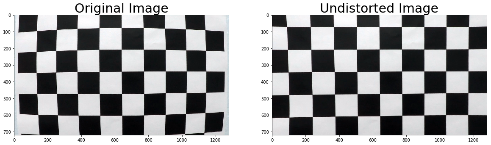
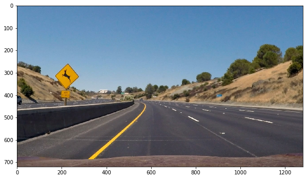
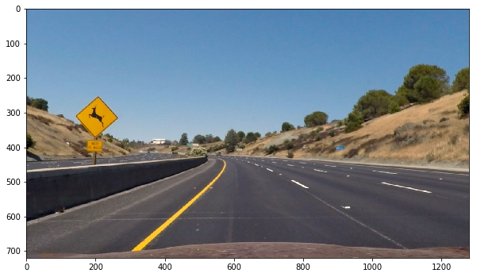
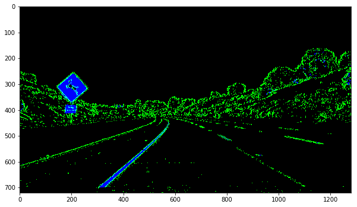
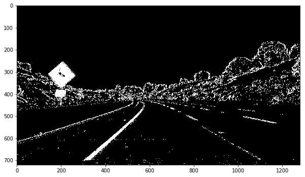
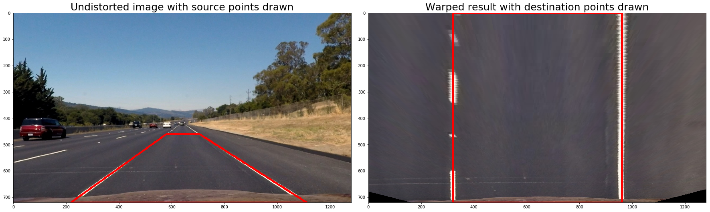
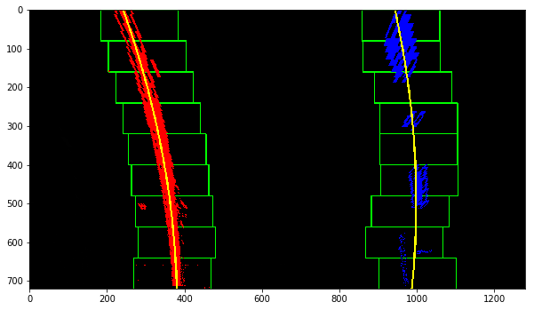
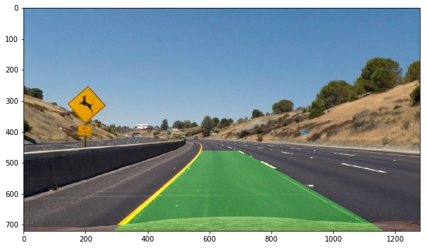
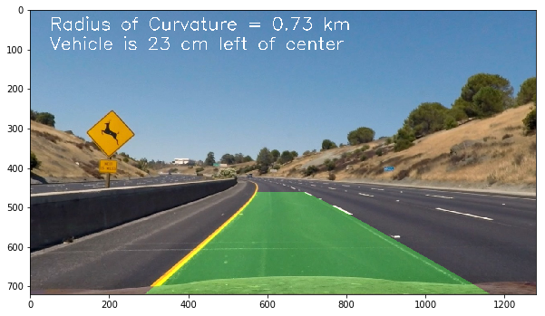

# Advanced Lane Finding Project

The goals / steps of this project are the following:

* Compute the camera calibration matrix and distortion coefficients given a set of chessboard images.
* Apply a distortion correction to raw images.
* Use color transforms, gradients, etc., to create a thresholded binary image.
* Apply a perspective transform to rectify binary image ("birds-eye view").
* Detect lane pixels and fit to find the lane boundary.
* Determine the curvature of the lane and vehicle position with respect to center.
* Warp the detected lane boundaries back onto the original image.
* Output visual display of the lane boundaries and numerical estimation of lane curvature and vehicle position.

TODO:
- [Rubric](https://review.udacity.com/#!/rubrics/571/view) Points
- Here I will consider the rubric points individually and describe how I addressed each point in my implementation.
- [Template writeup](https://github.com/udacity/CarND-Advanced-Lane-Lines/blob/master/writeup_template.md)

### Camera Calibration

TODO: Briefly state how you computed the camera matrix and distortion coefficients. Provide an example of a distortion corrected calibration image.

The code for this step is contained in the code cells belonging to section "Compute the camera calibration matrix and distortion coefficients given a set of chessboard images" of the IPython notebook located in `./AdvancedLaneLines.ipynb`).  

I start by preparing "object points", which will be the (x, y, z) coordinates of the chessboard corners in the world. Here I am assuming the chessboard is fixed on the (x, y) plane at z=0, such that the object points are the same for each calibration image.  Thus, `objp` is just a replicated array of coordinates, and `objpoints` will be appended with a copy of it every time I successfully detect all chessboard corners in a test image.  `imgpoints` will be appended with the (x, y) pixel position of each of the corners in the image plane with each successful chessboard detection.  

I then used the output `objpoints` and `imgpoints` to compute the camera calibration and distortion coefficients using the `cv2.calibrateCamera()` function.  I applied this distortion correction to the test image `camera_cal/calibration1.jpg` using the `cv2.undistort()` function and obtained this result:



### Pipeline (single images)

The pipeline starts receiving an image like this one (`test_images/test2.jpg`):



#### Distortion Correction

TODO:
- describe how I apply the distortion correction to the image
- linkes unteres Rechteck (0, 680) - (200, 720) aus dem Originalbild und dem undistorted Bild ausschneiden und anzeigen. Unterschiede beschreiben.
- Code: `undistort(image, calibration_data)` im notebook

Then the input image is distortion corrected using the `cv2.undistort()` function applied to the calibration and distortion coefficients obtained from the `cv2.calibrateCamera()` function as described in the section "Camera Calibration". This results in the following distortion corrected image:



#### Color Transforms and Gradients

TODO:
- Describe how (and identify where in your code) you used color transforms, gradients or other methods to create a thresholded binary image.
- (+) Provide an example of a binary image result.
- Code `create_binary_images()`:
  1. use the Sobel operator to obtain the derivative in x direction of the l-channel (warum l-channel?) of the image, `x_derivative_thresholds = (20, 100)`. So we get vertical edges which comes close to my understanding of lane lines. (green)
  2. apply `s_channel_thresholds = (170, 255)` to the s-channel of the image. (blue)

I used a combination of color and gradient thresholds to generate a binary image (function `create_binary_images()` in section "Use color transforms, gradients, etc., to create a thresholded binary image" in the notebook).  Here's an example of my output for this step:





#### Perspective Transform

TODO:
- Describe how (and identify where in your code) you performed a perspective transform and provide an example of a transformed image.

The code for my perspective transform includes a function called `warpPerspective()`, which appears in section "Apply a perspective transform to rectify binary image ("birds-eye view")" of the IPython notebook. The `warpPerspective()` function takes as inputs an image (`image`), as well as source (`src`) and destination (`dst`) points.  I chose to hardcode the source and destination points in the following manner:

```python
src = np.float32(
    [
        ((get_width(img) / 2) - 55, get_height(img) / 2 + 100),
        (((get_width(img) / 6) - 10), get_height(img)),
        ((get_width(img) * 5 / 6) + 60, get_height(img)),
        ((get_width(img) / 2 + 55), get_height(img) / 2 + 100)
    ])
dst = np.float32(
    [
        ((get_width(img) / 4), 0),
        ((get_width(img) / 4), get_height(img)),
        ((get_width(img) * 3 / 4), get_height(img)),
        ((get_width(img) * 3 / 4), 0)
    ])
```

This resulted in the following source and destination points:

|   Source (x, y)    | Destination (x, y) |
|:------------------:|:------------------:|
|     (585, 460)     |      (320, 0)      |
| (203.33333,   720) |     (320, 720)     |
| (1126.6666,   720) |     (960, 720)     |
|     (695, 460)     |      (960, 0)      |

I verified that my perspective transform was working as expected by drawing the `src` and `dst` points onto a test image and its warped counterpart to verify that the lines appear parallel in the warped image.




#### Lane Lines

TODO:
- Describe how (and identify where in your code) you identified lane-line pixels and fit their positions with a polynomial?
- identify lane-line pixels: `find_lane_pixels()`, how?
- fit their positions with a polynomial: `fit_polynomial()`, how?

Then I did some other stuff and fit my lane lines with a 2nd order polynomial kinda like this:





#### Radius of Curvature

TODO:
- Describe how (and identify where in your code) you calculated the radius of curvature of the lane and the position of the vehicle with respect to center.
- Code: `get_curvature()` = (left_curverad + right_curverad)/2

I did this in lines # through # in my code in `my_other_file.py`

#### Vehicle Position

TODO:
- Code: `get_vehicle_position()` =  get_center_of_car() - get_midpoint_of_lane()

#### Lane Area on Road

TODO:
- Provide an example image of your result plotted back down onto the road such that the lane area is identified clearly.
- Code: `project_lane_area_onto_undistorted_image()`

I implemented this step in lines # through # in my code in `yet_another_file.py` in the function `map_lane()`.  Here is an example of my result on a test image:



---

### Pipeline (video)

TODO: 1. Provide a link to your final video output.  Your pipeline should perform reasonably well on the entire project video (wobbly lines are ok but no catastrophic failures that would cause the car to drive off the road!).

Here's a [link to my video result](test_videos_output/project_video.mp4)

---

### Discussion

TODO: Briefly discuss any problems / issues you faced in your implementation of this project. Where will your pipeline likely fail?  What could you do to make it more robust?

Here I'll talk about the approach I took, what techniques I used, what worked and why, where the pipeline might fail and how I might improve it if I were going to pursue this project further.  
